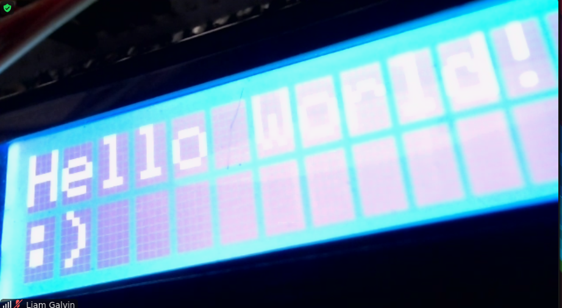
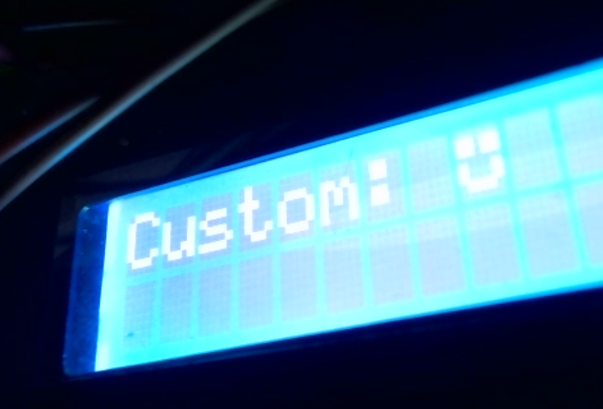

# lcd

A Go module for driving common LCD devices (those using the HD44780 controller or similar.)

Built for Raspberry Pi, but it should work with any other device where you can use an implementation of the [`lcd.Pin`](https://github.com/liamg/lcd/blob/main/pin.go#L3-L9) interface.

- Supports both 4 and 8-bit modes
- Allows definition and use of custom characters
- Tested against virtual LCD (also included in this package)
- Uses BF checking instead of fixed delays for greater efficiency unlike most LCD libraries (pass `nil` as the RW pin if you don't want to use this, and wire the RW pin to GND)

## Example

```golang
package main

import (
	"github.com/liamg/lcd"
	"github.com/stianeikeland/go-rpio/v4"
)

func main() {

	_ = rpio.Open()
	defer rpio.Close()

	lcd, _ := lcd.New1602(
		lcd.FontSize5x8,
		rpio.Pin(24),                                         // RS
		rpio.Pin(25),                                         // E
		rpio.Pin(12),                                         // RW
		rpio.Pin(5), rpio.Pin(6), rpio.Pin(13), rpio.Pin(19), // DATA
	)

	lcd.WriteLine(0, "Hello World!")
	lcd.WriteLine(1, ":)")
}
```



### Custom characters



